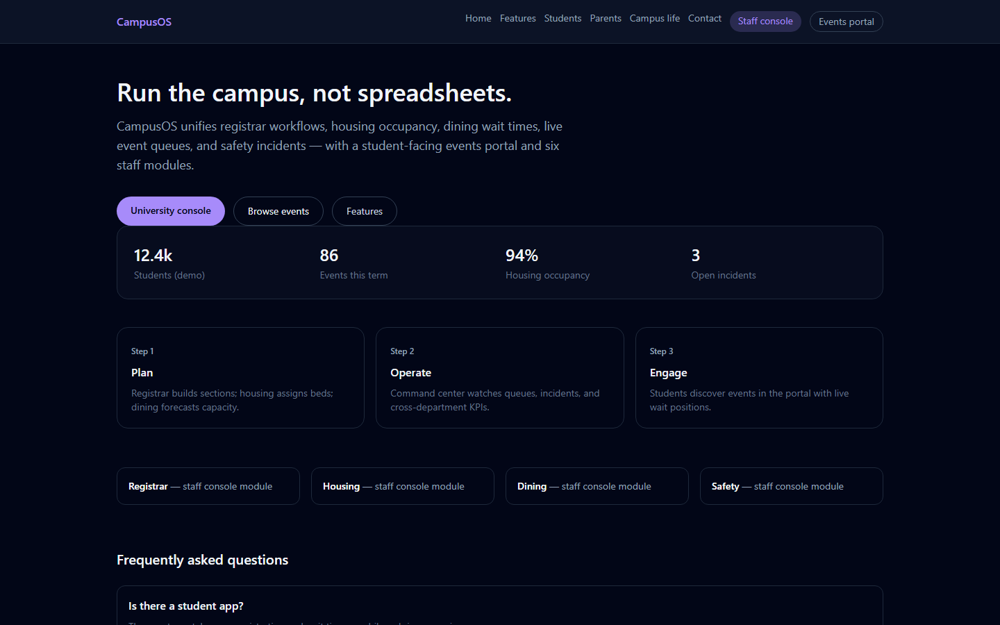
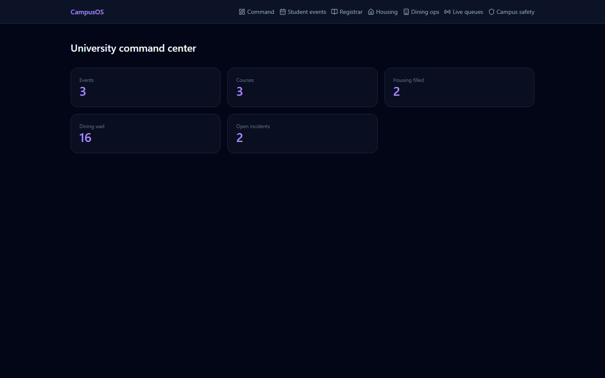
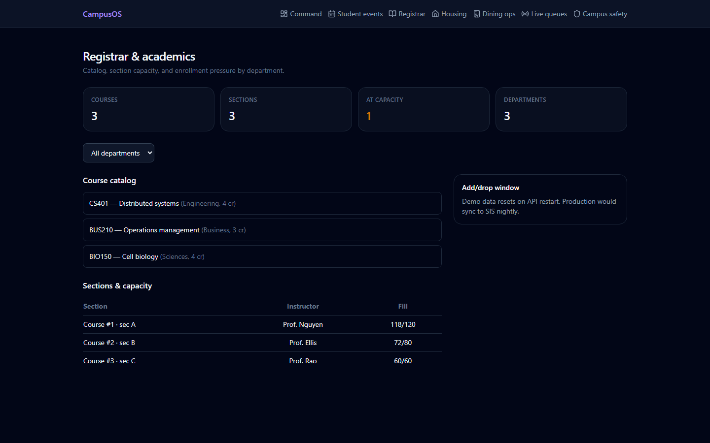
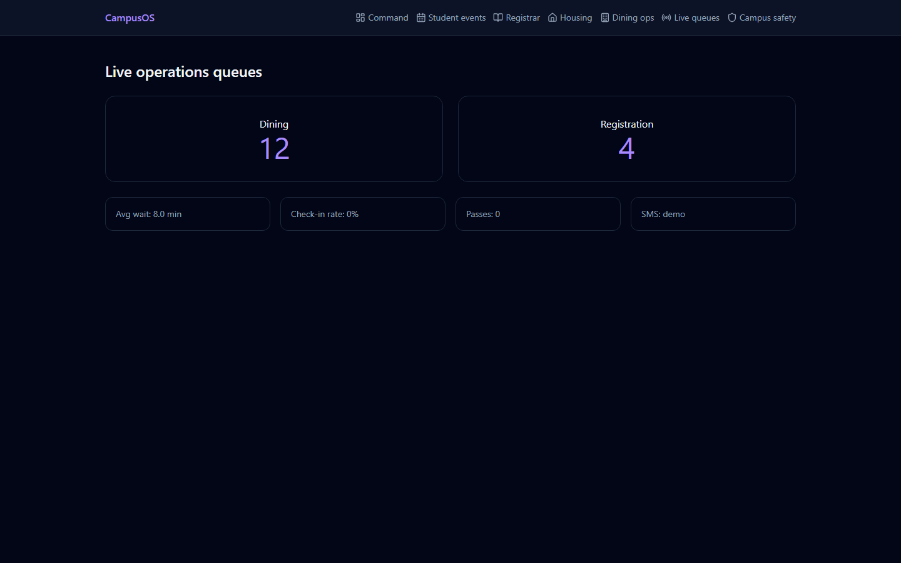
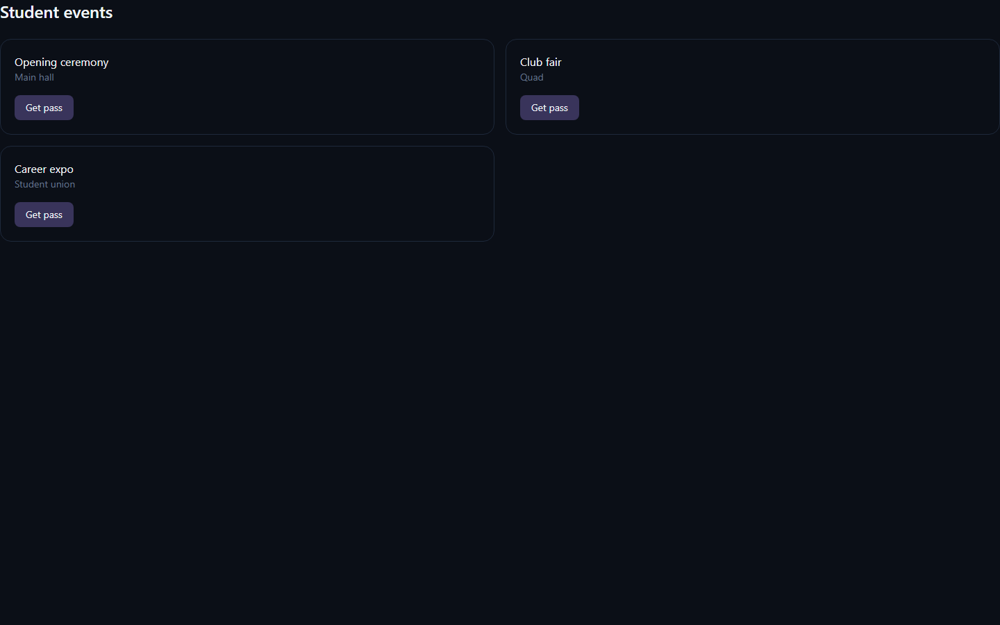
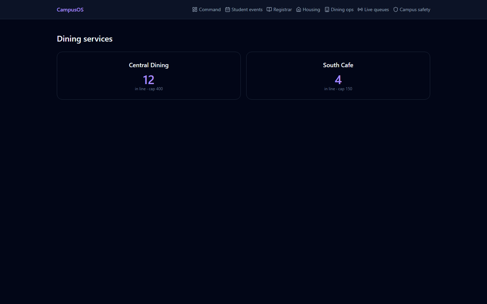

# CampusOS — university operations platform








Express + SQLite API with registrar, housing, dining, events, safety and live queue endpoints (queue updates stream over server-sent events), plus a Vite + React student portal and admin console.

## Student portal

`/portal/events` — event registration & QR passes.

## Admin console

http://localhost:3014/console

| Module | Route |
|--------|--------|
| Command | `/console` |
| Registrar | `/console/registrar` |
| Housing | `/console/housing` |
| Dining | `/console/dining` |
| Live ops | `/console/ops` |
| Safety | `/console/safety` |

Public pages (`/`, `/features`, `/students`, `/parents`, `/campus-life`, `/contact`) are served by the same web app.

## Run

Setup (once):

```powershell
cd api-node
npm install
cd ..\web
copy .env.example .env
npm install
```

Then from the repo root:

```powershell
.\run.ps1
```

`run.ps1` starts **api-node** (port **8014**, `npm run dev`) in a new window and the web app on port **3014** with `VITE_API_BASE=http://localhost:8014`.

The API stores data in `api-node\data\campus.db`; delete it to re-seed.

## Tests

```powershell
cd api-node
npm test
```

Uses Node's built-in test runner (`node:test`). It boots the real API on port 18014 with a throwaway `DATA_DIR` (the API honours `DATA_DIR` to relocate the SQLite file) and checks health, seeded events, command overview, event registration, QR generation and check-in (success and 404).

## Author

**Alexsandro Sunaga**

## License

MIT License — see [LICENSE](LICENSE).
